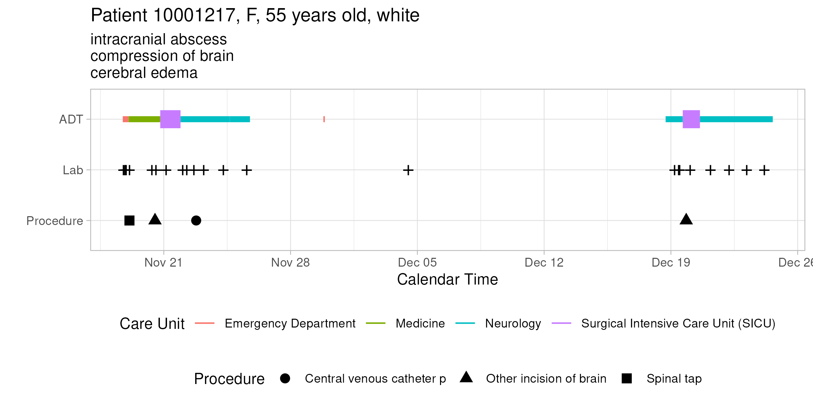
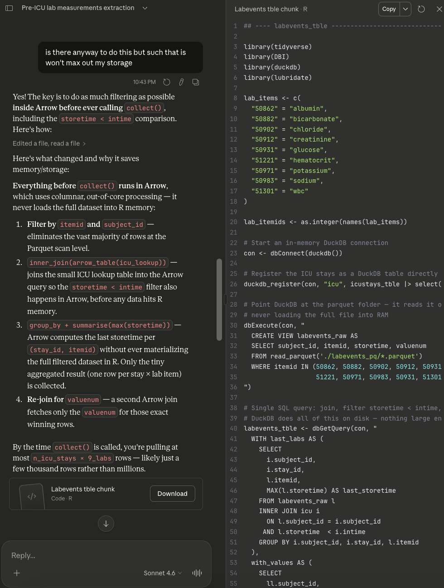
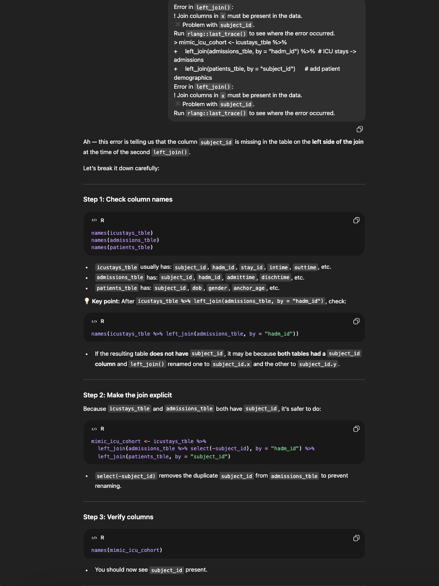
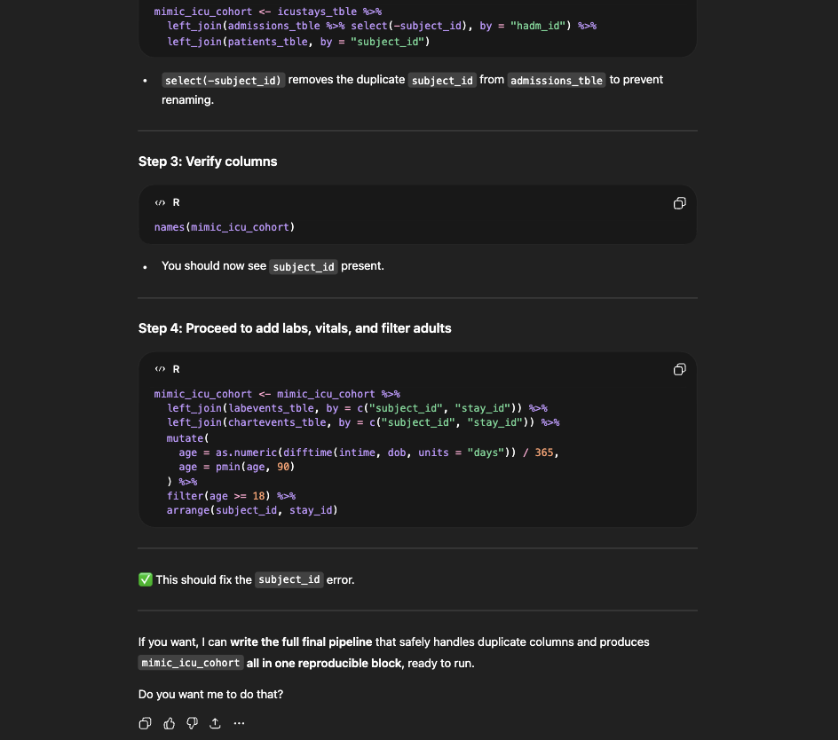
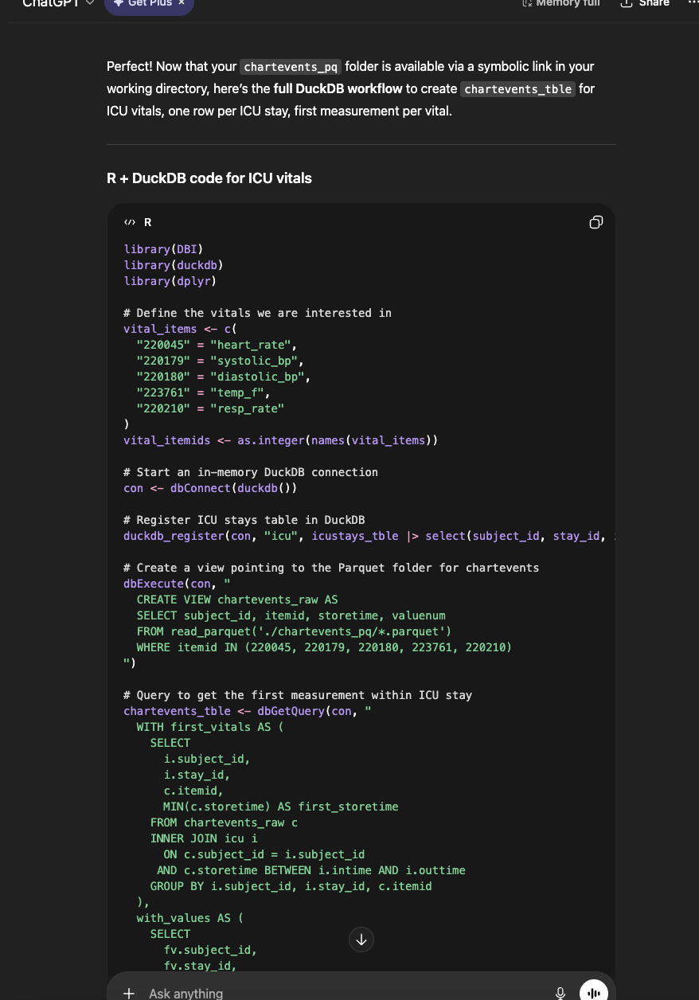

Display machine information for reproducibility:

```{r}
sessionInfo()
```

Load necessary libraries (you can add more as needed).

```{r setup}
#| message: false
#| warning: false
library(arrow)
library(gtsummary)
library(memuse)
#library(pryr) didn't work for my version of R
library(lobstr)
library(R.utils)
library(tidyverse)
library(styler)
```

Display your machine memory.

```{r}
memuse::Sys.meminfo()
```

In this exercise, we use tidyverse (ggplot2, dplyr, etc) to explore the [MIMIC-IV](https://physionet.org/content/mimiciv/3.1/) data introduced in [homework 1](https://ucla-biostat-203b.github.io/2026winter/hw/hw1/hw1.html) and to build a cohort of ICU stays.

## Q1. Visualizing patient trajectory

Visualizing a patient's encounters in a health care system is a common task in clinical data analysis. In this question, we will visualize a patient's ADT (admission-discharge-transfer) history and ICU vitals in the MIMIC-IV data.

### Q1.1 ADT history

A patient's ADT history records the time of admission, discharge, and transfer in the hospital. This figure shows the ADT history of the patient with `subject_id` 10001217 in the MIMIC-IV data. The x-axis is the calendar time, and the y-axis is the type of event (ADT, lab, procedure). The color of the line segment represents the care unit. The size of the line segment represents whether the care unit is an ICU/CCU. The crosses represent lab events, and the shape of the dots represents the type of procedure. The title of the figure shows the patient's demographic information and the subtitle shows top 3 diagnoses.

Do a similar visualization for the patient with `subject_id` 10063848 using ggplot.

Hint: We need to pull information from data files `patients.csv.gz`, `admissions.csv.gz`, `transfers.csv.gz`, `labevents.csv.gz`, `procedures_icd.csv.gz`, `diagnoses_icd.csv.gz`, `d_icd_procedures.csv.gz`, and `d_icd_diagnoses.csv.gz`. For the big file `labevents.csv.gz`, use the Parquet format you generated in Homework 2. For reproducibility, make the Parquet folder `labevents_pq` available at the current working directory `hw3`, for example, by a symbolic link. Make your code reproducible.

```{bash}
#| eval: false
#ls ~/Documents
#ls ~/Documents/biostat-203b-2026-winter
#ls ~/Documents/biostat-203b-2026-winter/hw2

ls ~/Downloads/mimic-iv-3.1/hosp
ls ~/Downloads/mimic-iv-3.1/icu

gzcat ~/Downloads/mimic-iv-3.1/hosp/admissions.csv.gz | head -n 2

```

```{r}
#| eval: false
library(arrow)
library(readr)
library(dplyr)
library(fs)

csv_file <- "~/Downloads/mimic-iv-3.1/hosp/labevents.csv.gz"
parquet_dir <- "~/Downloads/mimic-iv-3.1/hosp/labevents_pq"

# Remove old folder
unlink(parquet_dir, recursive = TRUE)
Sys.sleep(2)

# Just do the conversion directly - let Arrow handle it
arrow::read_csv_arrow(csv_file) %>%
  arrow::write_dataset(parquet_dir, format = "parquet")

cat("Done!\n")

# Check the files
files <- list.files("~/Downloads/mimic-iv-3.1/hosp/labevents_pq/", pattern = "parquet$")
cat(sprintf("Created %d parquet files\n", length(files)))

# Check sizes
parquet_dir <- "~/Downloads/mimic-iv-3.1/hosp/labevents_pq"
sizes_mb <- sum(file.info(list.files(parquet_dir, full.names = TRUE))$size) / 1024^2
cat(sprintf("Total size: %.0f MB\n", sizes_mb))

# Verify you can read it
library(arrow)
ds <- arrow::open_dataset(parquet_dir, format = "parquet")
n_rows <- ds %>% count() %>% collect() %>% pull(n)
cat(sprintf("Total rows: %d\n", n_rows))
```

```{bash}
#| eval: false
#ln -s ~/Downloads/mimic-iv-3.1/hosp/labevents_pq ./labevents_pq
#ls -la labevents_pq/

cd ~/Documents/biostat-203b-2026-winter/hw3
ln -s ~/Downloads/mimic-iv-3.1/hosp/labevents_pq ./labevents_pq


```

```{r}
#| warning: false
library(tidyverse)
library(arrow)
library(lubridate)

# Changeable
subject_id_input <- 10063848

# Load tables
mimic_path <- "../../../Downloads/mimic-iv-3.1/hosp"
patients   <- read_csv(gzfile(file.path(mimic_path, "patients.csv.gz")), show_col_types = FALSE)
admissions <- read_csv(gzfile(file.path(mimic_path, "admissions.csv.gz")), show_col_types = FALSE)
transfers  <- read_csv(gzfile(file.path(mimic_path, "transfers.csv.gz")), show_col_types = FALSE)
procedures <- read_csv(gzfile(file.path(mimic_path, "procedures_icd.csv.gz")), show_col_types = FALSE)
diagnoses  <- read_csv(gzfile(file.path(mimic_path, "diagnoses_icd.csv.gz")), show_col_types = FALSE)
d_proc     <- read_csv(gzfile(file.path(mimic_path, "d_icd_procedures.csv.gz")), show_col_types = FALSE)
d_diag     <- read_csv(gzfile(file.path(mimic_path, "d_icd_diagnoses.csv.gz")), show_col_types = FALSE)

# Load parquet from your symlink
labs <- open_dataset("./labevents_pq", format = "parquet")

# Patient Info & Top 3 diagnoses
patient_info <- patients %>%
  filter(subject_id == subject_id_input)

top_diag <- diagnoses %>%
  filter(subject_id == subject_id_input) %>%
  left_join(d_diag, by = "icd_code") %>%
  slice_head(n = 3) %>%
  pull(long_title)

# ADT Transfers
adt <- transfers %>%
  filter(subject_id == subject_id_input) %>%
  mutate(
    intime  = ymd_hms(intime),
    outtime = ymd_hms(outtime),
    is_icu  = str_detect(careunit, "ICU|CCU")
  )

# Lab events
lab_itemids <- c(50862, 50912, 50971, 50983, 50902, 50882, 51221, 51301, 50931)

lab_events <- labs %>%
  filter(subject_id == subject_id_input, itemid %in% lab_itemids) %>%
  select(charttime) %>%
  collect() %>%
  mutate(charttime = ymd_hms(charttime)) %>%
  distinct()

# Procedures
proc_events <- procedures %>%
  filter(subject_id == subject_id_input) %>%
  left_join(d_proc, by = "icd_code") %>%
  mutate(charttime = ymd(chartdate))

# Building Titles/Subtitles
age <- patient_info$anchor_age
title_text <- paste0(
  "Patient ", subject_id_input, ", ",
  patient_info$gender, ", ",
  age, " years old, ",
  patient_info$race
)
subtitle_text <- paste(top_diag, collapse = "\n")
```

```{r}
#FINAL VISUALIZATION

ggplot() +
  # ADT segments
  geom_segment(
    data = adt,
    aes(x = intime, xend = outtime,
        y = "ADT", yend = "ADT",
        color = careunit,
        linewidth = is_icu)
  ) +
  # Lab crosses
  geom_point(
    data = lab_events,
    aes(x = charttime, y = "Lab"),
    shape = 3,
    size = 2
  ) +
  # Procedures
  geom_point(
    data = proc_events,
    aes(x = charttime,
        y = "Procedure",
        shape = long_title),
    size = 3
  ) +
  scale_linewidth_manual(values = c(0.7, 2), guide = "none") +
  scale_y_discrete(limits = rev) +
  labs(
    title = title_text,
    subtitle = subtitle_text,
    x = "Calendar Time",
    y = NULL,
    color = "Care Unit",
    shape = "Procedure"
  ) +
  theme_minimal(base_size = 14) +
  theme(
    plot.title = element_text(face = "bold", size = 18),
    plot.subtitle = element_text(size = 14),
    legend.position = "bottom",
    axis.text.y = element_text(size = 13)
  ) 
```

### Q1.2 ICU stays

ICU stays are a subset of ADT history. This figure shows the vitals of the patient `10001217` during ICU stays. The x-axis is the calendar time, and the y-axis is the value of the vital. The color of the line represents the type of vital. The facet grid shows the abbreviation of the vital and the stay ID.


Do a similar visualization for the patient `10063848`.

```{bash}

#gunzip -c ~/Downloads/mimic-iv-3.1/icu/d_items.csv.gz | grep -E "HR|NBPd|NBPs|RR|Temperature"

#vital_itemids <- c(
 # 220045,  # HR
 # 220179,  # NBPs (systolic)
 # 220180,  # NBPd (diastolic)
 # 220210,  # RR
#  223761  ) # Temperature Fahrenheit


```

```{r}
library(tidyverse)
library(arrow)
library(lubridate)

# Configuration
subject_id_input <- 10063848
icu_path <- "../../../Downloads/mimic-iv-3.1/icu"
hosp_path <- "../../../Downloads/mimic-iv-3.1/hosp"

# Load small files with read_csv
icustays <- read_csv(gzfile(file.path(icu_path, "icustays.csv.gz")), show_col_types = FALSE)
d_items <- read_csv(gzfile(file.path(icu_path, "d_items.csv.gz")), show_col_types = FALSE)

# Use Arrow to read large chartevents - much faster!
vital_itemids <- c(220045, 220179, 220180, 220210, 223761)

chartevents_dataset <- open_dataset(file.path(icu_path, "chartevents.csv.gz"), format = "csv")

vitals_icu <- chartevents_dataset %>%
  filter(subject_id == subject_id_input, itemid %in% vital_itemids) %>%
  select(stay_id, charttime, itemid, valuenum) %>%
  collect() %>%
  mutate(charttime = ymd_hms(charttime)) %>%
  filter(!is.na(valuenum)) %>%
  left_join(d_items %>% select(itemid, abbreviation), by = "itemid") %>%
  inner_join(
    icustays %>% 
      filter(subject_id == subject_id_input) %>%
      mutate(intime = ymd_hms(intime), outtime = ymd_hms(outtime)) %>%
      select(stay_id, intime, outtime),
    by = "stay_id"
  ) %>%
  filter(charttime >= intime & charttime <= outtime) %>%
  select(stay_id, charttime, abbreviation, valuenum)

# Create plot
p <- ggplot(vitals_icu, aes(x = charttime, y = valuenum, color = abbreviation)) +
  geom_point(size = 2) +
  geom_line(alpha = 0.6) +
  facet_grid(abbreviation ~ stay_id, scales = "free_y") +
  labs(
    title = sprintf("Patient %d ICU stays - Vitals", subject_id_input),
    x = "Calendar Time",
    y = "Value"
  ) +
  theme_minimal() +
  theme(
    plot.title = element_text(face = "bold", size = 16),
    axis.text.x = element_text(angle = 45, hjust = 1, size = 9),
    legend.position = "right"
  )

print(p)
#ggsave("icu_vitals_10063848.png", width = 16, height = 10, dpi = 300)
#cat("✓ Saved: icu_vitals_10063848.png\n")
```

## Q2. ICU stays

`icustays.csv.gz` (<https://mimic.mit.edu/docs/iv/modules/icu/icustays/>) contains data about Intensive Care Units (ICU) stays. The first 10 lines are

```{bash}
zcat < ~/mimic/icu/icustays.csv.gz | head
```

### Q2.1 Ingestion

Import `icustays.csv.gz` as a tibble `icustays_tble`.

```{r}

icustays_tble <- read_csv(gzfile(file.path(icu_path, "icustays.csv.gz")), show_col_types = FALSE)


icustays_tble <- read_csv(gzfile(file.path(icu_path, "icustays.csv.gz")), show_col_types = FALSE) %>%
  as_tibble()
```

### Q2.2 Summary and visualization

How many unique `subject_id`? Can a `subject_id` have multiple ICU stays? Summarize the number of ICU stays per `subject_id` by graphs.

```{r}
library(tidyverse)

icu_path <- "../../../Downloads/mimic-iv-3.1/icu"

# 1. How many unique subject_id?
n_unique_subjects <- icustays_tble %>%
  distinct(subject_id) %>%
  nrow()

cat(sprintf("Number of unique subject_id: %d\n", n_unique_subjects))

# 2. Can a subject_id have multiple ICU stays?
stays_per_subject <- icustays_tble %>%
  group_by(subject_id) %>%
  summarize(n_stays = n(), .groups = "drop")

max_stays <- max(stays_per_subject$n_stays)
cat(sprintf("Max ICU stays per subject_id: %d\n", max_stays))


```

```{r}
# Summarize: number of ICU stays per subject_id
stays_per_subject <- icustays_tble %>%
  group_by(subject_id) %>%
  summarize(n_stays = n(), .groups = "drop")

# Graph 1: Bar Chart of ICU stays distribution
p1 <- ggplot(stays_per_subject, aes(x = n_stays)) +
  geom_histogram(binwidth = 1, fill = "steelblue", color = "black") +
  scale_x_continuous(limits = c(0, 15)) +  # Limit x-axis to 0-30
  labs(
    title = "Distribution of Number of ICU Stays per Subject",
    x = "Number of ICU Stays",
    y = "Number of Subjects"
  ) +
  theme_minimal() +
  theme(plot.title = element_text(face = "bold", size = 14))

# Graph 2: Density plot
p2 <- ggplot(stays_per_subject, aes(x = n_stays)) +
  geom_density(fill = "steelblue", alpha = 0.6) +
  scale_x_continuous(limits = c(0, 15)) +  # Limit x-axis to 0-30
  labs(
    title = "Density of Number of ICU Stays per Subject",
    x = "Number of ICU Stays",
    y = "Density"
  ) +
  theme_minimal() +
  theme(plot.title = element_text(face = "bold", size = 14))

print(p1)
print(p2)

```

## Q3. `admissions` data

Information of the patients admitted into hospital is available in `admissions.csv.gz`. See <https://mimic.mit.edu/docs/iv/modules/hosp/admissions/> for details of each field in this file. The first 10 lines are

```{bash}
zcat < ~/mimic/hosp/admissions.csv.gz | head
```

### Q3.1 Ingestion

Import `admissions.csv.gz` as a tibble `admissions_tble`.

```{r}

hosp_path <- "../../../Downloads/mimic-iv-3.1/hosp"

admissions_tble <- read_csv(gzfile(file.path(hosp_path, "admissions.csv.gz")), show_col_types = FALSE)

head(admissions_tble)
```

### Q3.2 Summary and visualization

Summarize the following information by graphics and explain any patterns you see.

-   **number of admissions per patient**
    -   Most patients have only one hospital admission, while a smaller number of patients experience multiple admissions. The frequency of patients decreases as the number of admissions increases.
    -   This is most likely because many hospital stays are likely for a single acute issue, so those patients don’t need to come back repeatedly. However, a smaller group of patients—such as those with chronic conditions or more serious health problems—are admitted multiple times, which creates the long right tail of the distribution.

```{r}

library(dplyr)

admiss_per_patient <- admissions %>%
  group_by(subject_id) %>%
  summarise(n_admissions = n()) %>%
  ungroup()

ggplot(admiss_per_patient, aes(x = n_admissions)) +
  geom_histogram(binwidth = 1, fill = "steelblue") +
  coord_cartesian(xlim = c(1, 20)) +
  labs(
    title = "Distribution of Number of Admissions per Patient",
    x = "Number of Admissions",
    y = "Number of Patients"
  ) +
  theme_minimal()
```

-   **admission hour (anything unusual?)**
    -   The hour of admission is based on a 0 to 23 scale and the most common hour of admission is the 0th hour/midnight followed by later times (14th to 23rd hour). The 7th hour also has a high count of around 27,000 number of admissions.
    -   It is unusual how high the later hours are as well as how the 0th hour has the most number of admissions, sitting at over 40,000. This is likely not due to patients actually arriving exactly at midnight, but instead could reflect administrative recording practices. For example, if an exact admission time is unknown it is possible midnight may be used as a default timestamp. This would explain why hour 0 stands out so clearly compared to the surrounding hours.

```{r}
#change to hours
admissions_hour <- admissions %>%
  mutate(admission_hour = hour(admittime))

#by counts
hour_counts <- admissions_hour %>%
  count(admission_hour)

#plotting
ggplot(hour_counts, aes(x = admission_hour, y = n)) +
  geom_col(fill = "steelblue") +
  scale_x_continuous(breaks = 0:23) +
  labs(
    title = "Number of Admissions by Hour of Day",
    x = "Hour of Admission (0–23)",
    y = "Number of Admissions"
  ) +
  theme_minimal()
```

-   **admission minute (anything unusual?)**

    -   The distribution of number of admissions is around 8,000 with the highest count at the 0th minute with the fifteenth minute, 30th minute, and 45th minute of admission following.
    -   This pattern of 0, 15, 30, and 45 seems to likely have been used as a system default or sort of rounding method by the hospital.

    ```{r}
    #change to minutes
    admissions_minute <- admissions %>%
      mutate(admission_minute = minute(admittime))

    #counts
    minute_counts <- admissions_minute %>%
      count(admission_minute)

    #graph

    ggplot(minute_counts, aes(x = admission_minute, y = n)) +
      geom_col(fill = "steelblue") +
      scale_x_continuous(breaks = seq(0, 59, by = 5)) +
      labs(
        title = "Number of Admissions by Minute of the Hour",
        x = "Minute of Admission (0–59)",
        y = "Number of Admissions"
      ) +
      theme_minimal()
    ```

-   **length of hospital stay (from admission to discharge) (anything unusual?)**

    -   The distribution is heavily right skewed with 0 being the most common at 300,000 number of admissions. This is most likely because most people stay for less than a day for check ups, and treatment appointments. It is more expensive for people to stay for multiple days and those who need to stay are monitored for more critical conditions and treatments.

```{r}
los_data <- admissions %>%
  mutate(
    los_days = as.numeric(difftime(dischtime, admittime, units = "days"))
  )
summary(los_data$los_days)

#filtering out negatives
los_data <- los_data %>%
  filter(los_days >= 0)


ggplot(los_data, aes(x = los_days)) +
  geom_histogram(fill = "steelblue", bins = 70) +
  coord_cartesian(xlim = c(0, 75)) +
  labs(
    title = "Length of Stay (Zoomed to 30 Days)",
    x = "Length of Stay (Days)",
    y = "Number of Admissions"
  ) +
  theme_minimal()
```

According to the [MIMIC-IV documentation](https://mimic.mit.edu/docs/iv/about/concepts/#date-shifting),

> All dates in the database have been shifted to protect patient confidentiality. Dates will be internally consistent for the same patient, but randomly distributed in the future. Dates of birth which occur in the present time are not true dates of birth. Furthermore, dates of birth which occur before the year 1900 occur if the patient is older than 89. In these cases, the patient’s age at their first admission has been fixed to 300.

## Q4. `patients` data

Patient information is available in `patients.csv.gz`. See <https://mimic.mit.edu/docs/iv/modules/hosp/patients/> for details of each field in this file. The first 10 lines are

```{bash}
zcat < ~/mimic/hosp/patients.csv.gz | head
```

### Q4.1 Ingestion

Import `patients.csv.gz` (<https://mimic.mit.edu/docs/iv/modules/hosp/patients/>) as a tibble `patients_tble`.

```{r}
patients_tble <- read_csv("~/Downloads/mimic-iv-3.1/hosp/patients.csv.gz", show_col_types = FALSE)

```

### Q4.2 Summary and visualization

Summarize variables `gender` and `anchor_age` by graphics, and explain any patterns you see.

-   The distribution is slightly right skewed with 20 years old being the most common age with 25 and 30 following that.

-   There is a slight hump at 55-65 age range which makes sense because most common chronic conditions occur around then. The age range is till 90 because the data caps at then.

```{r}
ggplot(patients_tble, aes(x = anchor_age)) +
  geom_histogram(binwidth = 5, fill = "steelblue", color = "white") +
  scale_x_continuous(breaks = seq(0, 90, 10)) +
  labs(
    title = "Age Distribution of Patients (Capped at 90)",
    x = "Age (years)",
    y = "Number of Patients"
  ) +
  theme_minimal()

```

## Q5. Lab results

`labevents.csv.gz` (<https://mimic.mit.edu/docs/iv/modules/hosp/labevents/>) contains all laboratory measurements for patients. The first 10 lines are

```{bash}
zcat < ~/mimic/hosp/labevents.csv.gz | head
```

`d_labitems.csv.gz` (<https://mimic.mit.edu/docs/iv/modules/hosp/d_labitems/>) is the dictionary of lab measurements.

```{bash}
zcat < ~/mimic/hosp/d_labitems.csv.gz | head
```

We are interested in the lab measurements of albumin (50862), creatinine (50912), potassium (50971), sodium (50983), chloride (50902), bicarbonate (50882), hematocrit (51221), white blood cell count (51301), and glucose (50931). Retrieve a subset of `labevents.csv.gz` that only containing these items for the patients in `icustays_tble`. Further restrict to the last available measurement (by `storetime`) before the ICU stay. The final `labevents_tble` should have one row per ICU stay and columns for each lab measurement.


Hint: Use the Parquet format you generated in Homework 2. For reproducibility, make `labevents_pq` folder available at the current working directory `hw3`, for example, by a symbolic link.

```{r}
#| warning: true
library(DBI)
library(duckdb)

lab_items <- c(
  "50862" = "albumin",
  "50882" = "bicarbonate",
  "50902" = "chloride",
  "50912" = "creatinine",
  "50931" = "glucose",
  "51221" = "hematocrit",
  "50971" = "potassium",
  "50983" = "sodium",
  "51301" = "wbc"
)

lab_itemids <- as.integer(names(lab_items))

#start in-memory DuckDB connection
con <- dbConnect(duckdb())

# Register the ICU stays as a DuckDB table directly from R
duckdb_register(con, "icu", icustays_tble |> select(subject_id, stay_id, intime))

#point DuckDB at the parquet folder — it reads it out-of-core,
#not loading the full file into RAM
dbExecute(con, "
  CREATE VIEW labevents_raw AS
  SELECT subject_id, itemid, storetime, valuenum
  FROM read_parquet('./labevents_pq/*.parquet')
  WHERE itemid IN (50862, 50882, 50902, 50912, 50931,
                   51221, 50971, 50983, 50931, 51301)
")

#single SQL query: join, filter storetime < intime, take max storetime
#DuckDB does all of this on disk — nothing large enters R memory
labevents_tble <- dbGetQuery(con, "
  WITH last_labs AS (
    SELECT
      i.subject_id,
      i.stay_id,
      l.itemid,
      MAX(l.storetime) AS last_storetime
    FROM labevents_raw l
    INNER JOIN icu i
      ON l.subject_id = i.subject_id
     AND l.storetime  < i.intime
    GROUP BY i.subject_id, i.stay_id, l.itemid
  ),
  with_values AS (
    SELECT
      ll.subject_id,
      ll.stay_id,
      ll.itemid,
      l.valuenum
    FROM last_labs ll
    INNER JOIN labevents_raw l
      ON ll.subject_id     = l.subject_id
     AND ll.itemid         = l.itemid
     AND ll.last_storetime = l.storetime
  )
  PIVOT with_values
  ON itemid IN (
    50862, 50882, 50902, 50912, 50931,
    51221, 50971, 50983, 51301
  )
  USING first(valuenum)
") |>
  as_tibble() |>
  rename(
    albumin    = "50862",
    bicarbonate= "50882",
    chloride   = "50902",
    creatinine = "50912",
    glucose    = "50931",
    hematocrit = "51221",
    potassium  = "50971",
    sodium     = "50983",
    wbc        = "51301"
  ) |>
  right_join(
    icustays_tble |> select(subject_id, stay_id),
    by = c("subject_id", "stay_id")
  ) |>
  select(subject_id, stay_id,
         albumin, bicarbonate, chloride, creatinine, glucose,
         hematocrit, potassium, sodium, wbc) |>
  arrange(subject_id, stay_id)

dbDisconnect(con)

print(dim(labevents_tble))
print(head(labevents_tble))
```

## Q6. Vitals from charted events

`chartevents.csv.gz` (<https://mimic.mit.edu/docs/iv/modules/icu/chartevents/>) contains all the charted data available for a patient. During their ICU stay, the primary repository of a patient’s information is their electronic chart. The `itemid` variable indicates a single measurement type in the database. The `value` variable is the value measured for `itemid`. The first 10 lines of `chartevents.csv.gz` are

```{bash}
zcat < ~/mimic/icu/chartevents.csv.gz | head
```

`d_items.csv.gz` (<https://mimic.mit.edu/docs/iv/modules/icu/d_items/>) is the dictionary for the `itemid` in `chartevents.csv.gz`.

```{bash}
zcat < ~/mimic/icu/d_items.csv.gz | head
```

We are interested in the vitals for ICU patients: heart rate (220045), systolic non-invasive blood pressure (220179), diastolic non-invasive blood pressure (220180), body temperature in Fahrenheit (223761), and respiratory rate (220210). Retrieve a subset of `chartevents.csv.gz` only containing these items for the patients in `icustays_tble`. Further restrict to the first vital measurement (by `storetime`) within the ICU stay. The final `chartevents_tble` should have one row per ICU stay and columns for each vital measurement.


Hint: Use the Parquet format you generated in Homework 2. For reproducibility, make `chartevents_pq` folder available at the current working directory, for example, by a symbolic link.

```{bash}
~/Downloads/mimic-iv-3.1/icu/chartevents_pq/

ln -s ~/Downloads/mimic-iv-3.1/icu/chartevents_pq ./chartevents_pq

```

```{r}
#| eval: true

# Find your mimic path - check which one exists
file.exists("~/mimic/icu/chartevents.csv.gz")
file.exists("~/Documents/biostat-203b-2026-winter/mimic-iv-3.1/icu/chartevents.csv.gz")
list.files("~/Documents/biostat-203b-2026-winter/mimic-iv-3.1/icu/") 

# Remove the existing file
file.remove("chartevents_pq")

# Create as proper directory
dir.create("chartevents_pq")

# Now convert to parquet
library(arrow)
open_dataset(
  "~/mimic/icu/chartevents.csv.gz",
  format = "csv"
) |>
  write_dataset("chartevents_pq", format = "parquet")

# Verify
list.files("chartevents_pq")


con <- dbConnect(duckdb())
dbExecute(con, paste0("SET home_directory='", getwd(), "'"))

# Register ICU stays
duckdb_register(con, "icu", icustays_tble |> select(subject_id, stay_id, intime, outtime))

# Create the chartevents view
dbExecute(con, paste0("
  CREATE VIEW chartevents_raw AS
  SELECT subject_id, itemid, storetime, valuenum
  FROM read_parquet('", file.path(getwd(), "chartevents_pq", "*.parquet"), "')
  WHERE itemid IN (220045, 220179, 220180, 223761, 220210)
"))

# Run the main query
chartevents_tble <- dbGetQuery(con, "
  WITH first_storetimes AS (
    SELECT
      i.subject_id,
      i.stay_id,
      c.itemid,
      MIN(c.storetime) AS first_storetime
    FROM chartevents_raw c
    INNER JOIN icu i
      ON c.subject_id = i.subject_id
     AND c.storetime BETWEEN i.intime AND i.outtime
    GROUP BY i.subject_id, i.stay_id, c.itemid
  ),
  avg_values AS (
    SELECT
      fs.subject_id,
      fs.stay_id,
      fs.itemid,
      AVG(c.valuenum) AS avg_valuenum
    FROM first_storetimes fs
    INNER JOIN chartevents_raw c
      ON fs.subject_id      = c.subject_id
     AND fs.itemid          = c.itemid
     AND fs.first_storetime = c.storetime
    INNER JOIN icu i
      ON fs.stay_id = i.stay_id
     AND c.storetime BETWEEN i.intime AND i.outtime
    GROUP BY fs.subject_id, fs.stay_id, fs.itemid
  )
  PIVOT avg_values
  ON itemid IN (220045, 220179, 220180, 223761, 220210)
  USING avg(avg_valuenum)
") |>
  as_tibble() |>
  rename(
    heart_rate   = '220045',
    systolic_bp  = '220179',
    diastolic_bp = '220180',
    temp_f       = '223761',
    resp_rate    = '220210'
  ) |>
  right_join(
    icustays_tble |> select(subject_id, stay_id),
    by = c("subject_id", "stay_id")
  ) |>
  select(subject_id, stay_id, heart_rate, systolic_bp, diastolic_bp, temp_f, resp_rate) |>
  arrange(subject_id, stay_id)

dbDisconnect(con)

print(dim(chartevents_tble))
print(head(chartevents_tble))
```

## Q7. Putting things together

Let us create a tibble `mimic_icu_cohort` for all ICU stays, where rows are all ICU stays of adults (age at `intime` \>= 18) and columns contain at least following variables

-   all variables in `icustays_tble`
-   all variables in `admissions_tble`
-   all variables in `patients_tble`
-   the last lab measurements before the ICU stay in `labevents_tble`
-   the first vital measurements during the ICU stay in `chartevents_tble`

The final `mimic_icu_cohort` should have one row per ICU stay and columns for each variable.


```{r}

mimic_icu_cohort <- icustays_tble %>%
  left_join(admissions_tble, by = c("subject_id", "hadm_id"))

mimic_icu_cohort <- mimic_icu_cohort %>%
  left_join(patients_tble, by = "subject_id")

mimic_icu_cohort <- mimic_icu_cohort %>%
  left_join(labevents_tble, by = c("subject_id", "stay_id")) %>%
  left_join(chartevents_tble, by = c("subject_id", "stay_id"))

mimic_icu_cohort <- mimic_icu_cohort %>%
  filter(anchor_age >= 18) %>%
  arrange(subject_id, stay_id)
```

## Q8. Exploratory data analysis (EDA)

Summarize the following information about the ICU stay cohort `mimic_icu_cohort` using appropriate numerics or graphs:

-   Length of ICU stay `los` vs demographic variables (race, insurance, marital_status, gender, age at intime)

    ```{r}
    #LOS vs Race
    ggplot(mimic_icu_cohort, aes(x = race, y = los)) +
      geom_boxplot() +
      scale_y_continuous(trans = "log1p") +
      theme_minimal() +
      theme(axis.text.x = element_text(angle = 45, hjust = 1))

    #LOS vs Insurance
    ggplot(mimic_icu_cohort, aes(x = insurance, y = los)) +
      geom_boxplot() +
      scale_y_continuous(trans = "log1p") +
      theme_minimal()

    #LOS vs Gender
    ggplot(mimic_icu_cohort, aes(x = gender, y = los)) +
      geom_boxplot(fill = "steelblue") +
      scale_y_continuous(trans = "log1p") +
      labs(title = "ICU LOS by Gender",
           y = "Length of Stay (log scale)",
           x = "Gender") +
      theme_minimal() 

    #LOS vs Marital status
    ggplot(mimic_icu_cohort, aes(x = marital_status, y = los)) +
      geom_boxplot() +
      scale_y_continuous(trans = "log1p") +
      theme_minimal()

    #LOS vs Age at ICU admission
    ggplot(mimic_icu_cohort, aes(x = anchor_age, y = los)) +
      geom_point(alpha = 0.2) +
      geom_smooth(method = "gam", formula = y ~ s(x), color = "red") +
      scale_y_continuous(trans = "log1p") +
      labs(title = "ICU LOS vs Age",
           x = "Age",
           y = "Length of Stay (log scale)") +
      theme_minimal()
    ```

-   Length of ICU stay `los` vs the last available lab measurements before ICU stay

    ```{r}
    ggplot(mimic_icu_cohort, aes(x = los)) +
      geom_histogram(bins = 50) +
      labs(title = "Distribution of ICU Length of Stay",
           x = "ICU LOS (days)",
           y = "Count")

    mimic_icu_cohort <- mimic_icu_cohort %>%
      mutate(log_los = log(los))

    ggplot(mimic_icu_cohort, aes(x = creatinine, y = log_los)) +
      geom_point(alpha = 0.2) +
      geom_smooth(method = "loess") +
      labs(title = "Log ICU LOS vs Last Creatinine Before ICU",
           x = "Creatinine",
           y = "Log ICU LOS")
    ```

-   Length of ICU stay `los` vs the first vital measurements within the ICU stay

    ```{r}
    chartevents_tble |>
      left_join(mimic_icu_cohort |> select(stay_id, los), by = "stay_id") |>
      pivot_longer(
    cols = c(heart_rate, systolic_bp, diastolic_bp, temp_f, resp_rate),
    names_to = "vital",
    values_to = "value"
      ) |>
      ggplot(aes(x = value, y = los)) +
      geom_point(alpha = 0.2) +
      geom_smooth(method = "gam", formula = y ~ s(x), color = "red") +
      scale_y_continuous(trans = "log1p") +
      facet_wrap(~vital, scales = "free_x") +
      labs(title = "ICU LOS vs First Vital Measurements",
       x = "Vital Measurement",
       y = "Length of Stay (log scale)") +
      theme_minimal()
    ```

-   Length of ICU stay `los` vs first ICU unit

```{r}
ggplot(mimic_icu_cohort, aes(x = first_careunit, y = los)) +
  geom_boxplot() +
  scale_y_continuous(trans = "log1p") +
  labs(title = "ICU LOS vs First ICU Unit",
       x = "First Care Unit",
       y = "Length of Stay (log scale)") +
  theme_minimal() +
  theme(axis.text.x = element_text(angle = 45, hjust = 1))
```

## Q9. AI assistant

Which AI assistants (e.g., GitHub Copilot) do you use when working on this assignment? Which AI model (e.g., GPT-5 mini, GPT-5, Claude Sonnet 4.5) does the AI assistant use? How do you use them? Do you think they help improve your productivity?

Give 5 instances where AI model gave incorrect or misleading answers. You can use screenshots or copy-paste the Q&A.

   
